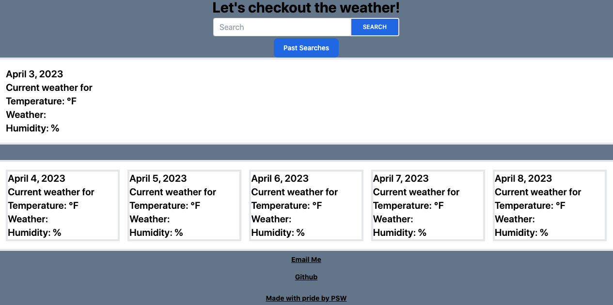

# <Weather Checker and 5 Day Forecast>

## Description

I was tasked to create a web application for the weather and forecast of a specific city. With this application, you can search your desired city within the US and get the current weather, and a five day forecast. This application also saves previous searches for you to look on in the model and call that data back for you to view.
## Installation

N/A

## Usage

Upon visiting the site, you will see empty cards with the placeholder text and a search bar in the header along with past searches. Upon entering in a US city, it will populate today’s current weather, and a five day forecast. Displaying the name of the city, the date, and icon of the weather conditions, the temperature and humidity as well as the wind speed.  If you search multiple cities, you can go into the past searches model and call a previously searched city and review its weather data with just a click.

Check it out for yourself! [Weather App Link Here](https://philippwinston.github.io/weather-tracker/).

## Credits
[open weather, API](https://openweathermap.org/api).  Used the API from Open Weather to call the current weather and forecast functions

## License

N/A